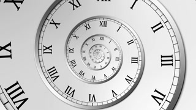

<p align="center">
  
</p>

# Vura (core)

[](https://clojars.org/kovacnica/vura.core)

Vura is small Clojure/script **zero dependency** time computation and manipulation library. Library uses numeric representation of
time to compute Gregorian calendar years, months and so on. Vura calculates time with current system offset by transforming local
timestamp value to UTC value at given time with function **time->value** that returns plain number of seconds. When computation/manipulation
is over numeric value of time should be transformed to Date representation by caling **value->time**.
For rest of core functions check [API docs](http://gersak.github.io/vura/api/vura.core.html).

Usual workflow would be to transform java.util.Date or some other object to numeric value with
**time->value** protocol implementation and afterwards do the computation in numeric domain.
vura.core offers at par functions to **clj(s)-time** only those functions work in numeric
domain and on immutable values. This means working with numbers instead of objects to compute values. After computation
is over if needed use **value->time** implementation of __TimeValueProtocol__ to transform numeric
values to _java.util.Date_ | _js/Date_, or leave them in numeric form if that fits you. Vura has nice macro
that transforms __Date__ instances to their value representations and afterwards evaluates body -> **time-as-value**. Use it
to reduce boilerplate when possible.


## Why?

* Immutability
* **Zero dependency**, only **clojure.core**
* Simple and familiar algebra in number domain
* Both Clojure and Clojurescript library with same 99% of code


## How?
Heart of this library is round-number function.

``` clojure
(defn round-number
  "Function returns round whole number that is devidable by target-number.
  Rounding strategy can be specified in round-how? options:

   :floor
   :ceil
   :up
   :down"
  ([number] (round-number number 1))
  ([number target-number] (round-number number target-number :down))
  ([number target-number round-how?]
   (assert (pos? target-number) "Target number has to be positive.")
   (case target-number
     0 0
     (let [round-how? (keyword round-how?)
           diff (rem number target-number)
           base (if (>= target-number 1)
                  (* target-number (quot number target-number))
                  (- number diff))
           limit (* 0.25 target-number target-number)
           compare-fn (case round-how?
                        :floor (constantly false)
                        :ceil (constantly (not (zero? diff)))
                        :up <=
                        <)]
       ((if (pos? number) + -)
        base
        (if (compare-fn limit (* diff diff)) target-number 0))))))
```

This is nice (and quick) function that doesn't just to rounding to 1 or 0 but to any target number whatsoever. I.E.
``` clojure

vura.core=> (time (round-number 182.8137172 0.25 :up))
"Elapsed time: 0.062 msecs"
182.75

vura.core=> (time (round-number 182.8137172 0.25 :down))
"Elapsed time: 0.123 msecs"
182.75

vura.core=> (time (round-number 182.8137172 0.25 :ceil))
"Elapsed time: 0.075 msecs"
183.0

vura.core=> (time (round-number 182.8137172 0.25 :floor))
"Elapsed time: 0.062 msecs"
182.75


```

Rounding strategy :floor and :ceil are selfexplanatory. :up and :down are different in that :up will
round number up if value is exactly half of target-number and :down will round number down.
Otherwise value will be rounded to nearest value. I.E.

``` clojure

vura.core=> (time (round-number 182.625 0.25 :down))
"Elapsed time: 0.072 msecs"
182.5

vura.core=> (time (round-number 182.625 0.25 :up))
"Elapsed time: 0.063 msecs"
182.75


```


## Choices and assumptions

Values of timestamps are normalized to Greenwich Mean Time. As base unit of time **vura** uses **second**.
This is not usual choice from programmers perspective but not that unusual for anyone else that is using
[SI](https://en.wikipedia.org/wiki/SI_base_unit). So bare with me it doesn't matter in the end anyway.

```clojure
(def second 1)
(def millisecond (/ second 1000))
(def microsecond (/ millisecond 1000))
(def nanosecond (/ microsecond 1000))
(def minute 60)
(def hour (* 60 minute))
(def day (* 24 hour))
(def week (* 7 day))
```

Time constructs defined this way can be easly added, subtracted, multiplied, devided, round-numbered.

```clojure
(defn seconds
  "Function returns value of n seconds as number."
  [n]
  (* n second))

(defn second?
  "Returns which second in day does input value belongs to. For example
  for date 15.02.2015 it will return number 0"
  [value]
  (int (mod value 60)))

(defn midnight
  "Function calculates value of midnight for given value. For example
  if some date value is inputed it will round-number to the begining of
  that day."
  [value]
  (round-number value day :floor))

```

Yout get the idea...


## What else?

How about... I've used to have alot of problems working with calendar, calculating weekends,
working days and holidays, calculating daily wage or spent/unused vacation days.
Vura offers functions like day-(time-)context:

```clojure
(->
    (date 2018 12 25 0 0 0 0)
    date->value
    day-time-context)


{:day 2,
 :hour 0,
 :week 52,
 :weekend? false,
 :first-day-in-month? false,
 :second 0,
 :value 1545696000,
 :month 12,
 :year 2018,
 :millisecond 0,
 :holiday? false,
 :last-day-in-month? false,
 :day-in-month 25,
 :minute 0}
```

day-(time-)context functions can be mapped to any sequence of vura time values. So it is possible
to `(iterate (partial + (days 3.5)) (date->value (date 2018)))` to get all dates with interval of 3.5
days till the end of time and afterwards apply map day-context and take 20 days for example. This is nice
but how do holidays fit in. Checkout **with-time-configuration** macro for customizing day-context computation.


## with-time-configuration

```clojure
(require '[vura.core :refer [date day day-context with-time-configuration date->value]])


(def hr-holidays
    #{[1 1]
      [6 1]
      [1 5]
      [22 6]
      [25 6]
      [5 8]
      [15 8]
      [8 10]
      [1 11]
      [25 12]
      [26 12]})

(def vacation-start (date 2030 6 15 8 0 0))

(with-time-configuration
    {:weekend-days #{5 6 7}
     :holiday? (fn [{:keys [day-in-month month]}]
                 (boolean (hr-holidays [day-in-month month])))}
    (->>
      (iterate (partial + day) (date->value vacation-start))
      (take 20)
      ;; Be carefull if this is not realized in with-time-configuration
      ;; configuration bindings won't work. Use mapv instead map
      (mapv day-context)
      (remove :holiday?)
      (remove :weekend?)
      count
      time))

"Elapsed time: 6.397 msecs"
11


```

What happend here? Lets say that we want to go on vacation from 15 of June for 20 days. There are some holidays in June as
well the fact that we are living in socially advanced culture with 3 day weekend that is Friday, Saturday and Sunday.
So how many days have we actually spent?


**with-time-configuration** macro allows us to put time values in context. Vura has dynamic variables **\*wekend-days\*,
\*week-days\* \*holiday?\*, \*offset\*** that can be used to put values in context. For example if we are interesed for
sequence of values what is theirs **day-context** with configuration definition above `(mapv day-context)`
will return vector of maps with following keys:

* value
* day
* week
* month
* year
* day-in-month
* weekend?
* holiday?
* first-day-in-month?
* last-day-in-month?


After that everything else is simple. We just remove :holiday? and :weekend? and we are left with only spent days. That is 11 days.

### Dragons
When using **with-time-configuration** values are calculated using defined **\*offset\***. This is computation scope and if you wan't
to use vura.core functions with above scope keep your computation in the scope, don't mix it with functions/values out of **with-time-configuration** scope. For example:

``` Clojure
(def formater (java.text.SimpleDateFormat. "EEE, d MMM yyyy HH:mm:ss Z"))

;; GOOD
(.format formater (with-time-configuration {:offset -60} (-> (date) date->value midnight time->value)))   ;; Tue, 5 Jun 2018 01:00:00 +0200
;; BAD!
(.format formater (value->time (with-time-configuration {:offset -60} (-> (date) date->value midnight)))) ;; Tue, 5 Jun 2018 00:00:00 +0200

;; GOOD
(with-time-configuration  {:offset 60} (-> (date) date->value midnight day?))   ;; 3
;; BAD!
(day? (with-time-configuration  {:offset 60} (-> (date) date->value midnight))) ;; 2

```
As mentioned Vura normalizes **time->value** to UTC, and does computations afterwards. When using **value->time**, **\*offset\*** dynamic
variable is used to return computed value to bound offset. By default **\*offset\*** is set to OS offset.


## Calendar Frame
**day-context** function solves most of calculation challenges. Still there are some use cases where it is usefull to have
function that can return day-context for whole month or year for given input value.
Multimethod **calendar-frame** provides implementations for **:year, :month** and **:week**
view for given value and can be extended to other frame types. This function might be usefull in frontend for creating different UI components
with OM or Reagent or some other Clojure/script frontend library. Don't forget to use **with-time-configuration** macro
to put context on calendar-frame (to flag holidays and weekend-days).


## Don't forget about round-number

Vura returns Date representations from numeric values and all values can be round-number(ed) so use that. Round
values to `(days 3.5)` or `(hours 11)` or maybe `(period {:week 2 :days 3})`


## Use clojure.core functions

**quot** is great way to calculate how long did some period(value) last in time units. For example
```clojure
(qout (period {:weeks 3 :hours 10 :minutes 11 :seconds 32821}) vura.core/hour) ;; 523

(qout (vura.core/interval (date 2018) (date 2019)) vura.core/minute) ;; 525600000
```
## License

Copyright © 2018 Robert Gersak

Released under the MIT license.
